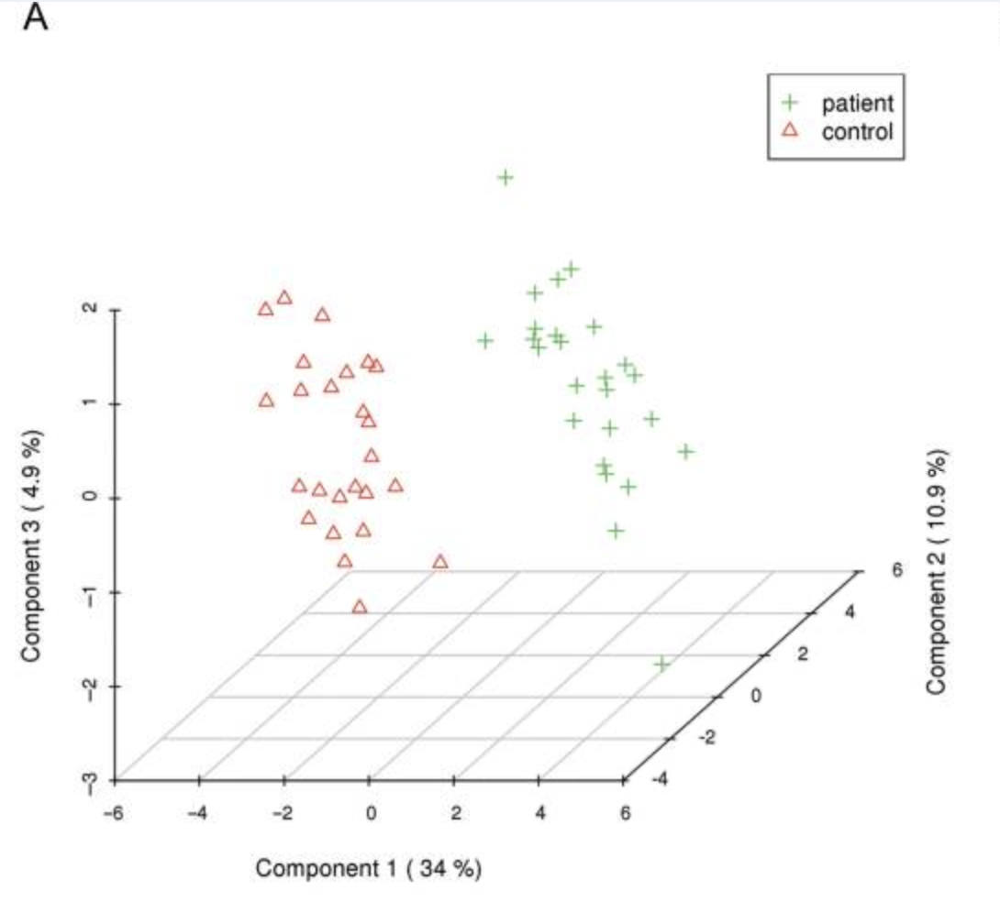

```{r, echo = FALSE, warning=FALSE}
library(tidyverse)
```

Here is some inline code `r 1 + 1`

```{r, starwars-plot, fig.cap="A ggplot of starwars stuff" }
starwars %>% 
  filter(species == 'Human') %>% 
  ggplot() +
  aes(x= height, y = mass) + 
  geom_point()
```
We can see in Figure \@ref(fig:starwars-plot) a graph.

```{r starwars-tbl}
starwars %>% 
  filter(species == 'Human') %>%
  select(name, 
         height,
         mass,
         homeworld) %>%
  knitr::kable(caption = "Caption")

```
We can see in Table \@ref(tab:starwars-tbl) a table..

```{r, my-fig, fig.cap = "my-fig"}


```
Just a PCA analysis \@ref(fig:my-fig)

"Terminologies for reproducible research". [@barba].
